# What is a indicator
- Indicators itself are not enough
- They help our system
- Possible entraces and exits
- Indicators to manage risk
- Lets try to use those that this course has to build systems
## What insights can it give to you
- Momentum and Trend Confirmation
- Overbought and Oversold Conditions
- Buying & Selling Aggression
- Trader Positioning
- Volatility Assessment
- Entry & Exit Signals
- Risk Management
- Time Efficiency
# CVD (Cumulative Volume Delta)
- Indicator for identifying buying and selling pressure in the market
- Delta = Difference
- Positive = Buying pressure
- Negative = Selling pressure
- Buyers & sellers = market orders (agression)
- When agression does not match price, take note
- Best on low timeframe (4hr or lower) and with fixed lookback period
- We can use it to spot divergences because we can see the CVD lowering when prices are upwards for example
- `coinalyze.net` to see the CVD (we should make sure that it analyzes the same lookback (number of candles))

- In this case there is high CVD but as you can see the price does not go up which means there is a divergence
- There is likely a big resistance in that area
- In this case we should go short
# How to trade CVD

- agregated spot are all the spot markets agregated
- Agregated futs is for the futures 
- Agregated futs bu coin-margined is futures but using another coins besides stable coins like usdt
- In this example there is a divergence since the spot increased since the beginning but the futures were going down
- Professor chages the lookback from where it appears to have a clear price trend (ex: the price is decreasing in the most candles)
- After changing it we check that there is harmony in the sense the CVD is decreasing and the price is decreasing as well which means we should continue in short mode

- If we want to check the behavior after the hammer in the graph we use the tool to check out how many candles we have since the candle after that hammer
- Then we change the lookback (number of candles) in the CVD
- With this we can check out the tend and make our confluation of indicators
- In this case the futures were pushing the price up and the spot is pushing it down
- Because of this we will most likely have a short squeeze
- We can do it per exchange and per pair altought is optional
- We can use probs, with same setup and play with for example the exchange x going wrong y times in that setup (patterns)
# Open Interest
- Open Interest = Number of open contracts in a futures market
- Long Opening + Short Opening = OI Increase
- Long Closing + Short Opening = OI Neutral
- Long Closing + Short Closing = OI Down
- Open Interest = Money Flowing In & Out
- In derivated contracts there is no market cap limit
- Volume is different because it only goes up because its the number of transactions
- Volume is time specific and open interest no
- The professor is using Agregated open interest
- If price is going down and the open interest is increasing, its prob there are a lot of shorts
# How to using OI Analysis to Trade
- We should look for
  - Significant changes in open interest
  - Confluence with price action (trend following)
  - Divergence from price action (mean reversion)
  - Confluence with other indicators

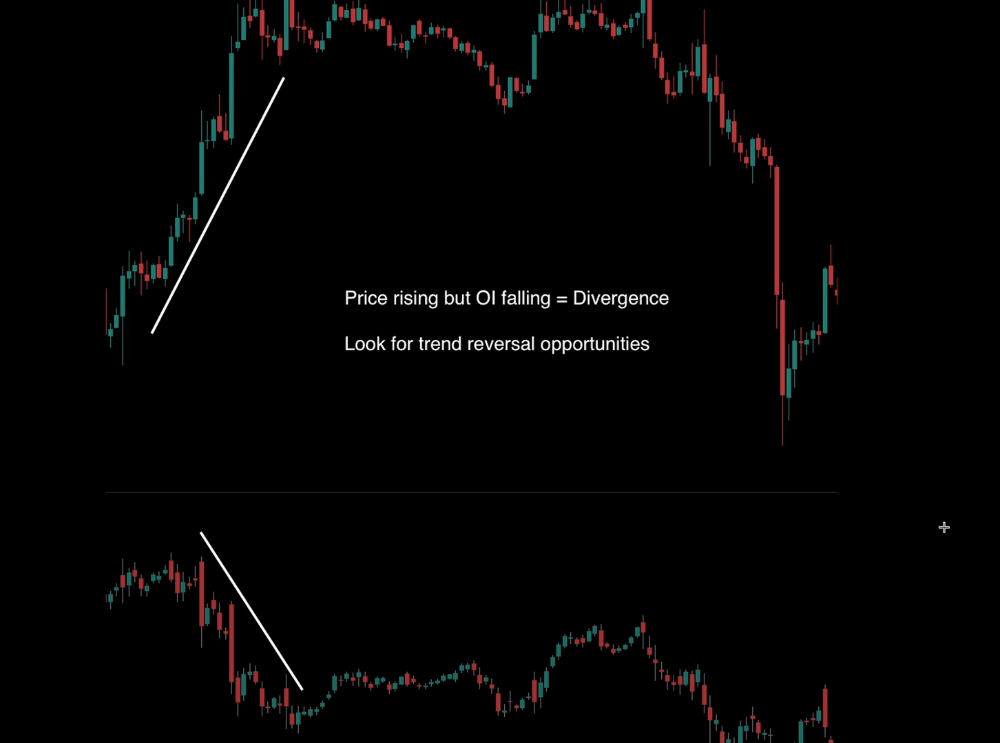

# Funding (Funding rate)
- Mechanism used to make price on spot and futures very close from each other
- In case there is a positive rate it means that the long positions pay to the short positions the given rate every 8h
  - And vice-versa in case the opposite occurs
- 0.0100 is a normal rate, having it bigger or negative may be a reason to take a trade with that in mind
- We can still go long if for example our position is increasing 15$ and you are paying 4$ of funding
- Same website to check this
- Aggregated Predicted Funding Rate AVG for lower time frames (usually the best to use)
- Aggregated funding rate AVG for higher time frames
- There are signs to watch 
  - Having side ways with multiple high funding rates
  - Its bearish to have side ways with high funding rates
  - Funding decreasing and price decreasing is a continuation bullish side
  - Funding decreasing and price is flat, prob bottom
  - In a bear market, negative funding can mean a big move down (multiple ones)
  - In a bull market, positive funding can mean a big move upward
  - dont fight the trend
  - Focus on the change from positive to negative (if it is fast), usually means a trend change
# Order flow
- To price to move we must have more aggression in one side than the other
- Actors
  - Taker
    - Market order
  - Maker
    - Limit Order
## Components
- Orderbook
  - Where we have the sell orders and buy orders
- Market trades
  - What is actually happening in terms of trades
  - This is where we can see the aggreession
- Website for orderbook analysis is `https://exocharts.com/web/` or [click here](https://exocharts.com/web/)
- tool analysis
  - blue is buyers aggression
  - red is sell agression
- the professor checks out trapped traders in the 1 min timeframe
  - We can see trapped orders when we have for example a lot of buying and a lot of selling next and vice versa using the footprint of the order flow charts
- In higher time frames we should check higher ticks (1h for example we should use Tick*100)
- In a trap its nice to see a double squeeze to trap in double those people
# Simple Moving Average (MA) & Exponential Moving Average (EMA)
- Used to analyze price trends
- MA = smoothed average prices
  - This has more relevance to traders
  - 50/100/200 MA common and hidely accepted levels 
- EMA = more weigth given to recent prices
  - This reacts faster to price movements
- Moving average is to understand if we are in a bullish or bearish trend (if it is upward or downard the average movement)
- EMAS for low time frame trades
- MA to bigger time frames
# Trading with Moving Averages (EMA) Bands
- Ema puts more weight in the more recent days
- Trends following
- Timeframe is subjective
- It works because other people use them as well
- They are not meant to hold perfectly
- Losing them often gives the best trades
- Using it with confluence
- H4 especifically,observer H4 close
- MSB + impulse off the bands is particularly strong
## Fast and slow EMAS
- Less days included means faster
- More days included means a slower trend
- Ex: 12 vs 21
- Also in case 12 is up 21 we are in a uptrend
- In case 12 is down 21 we are in a downtrend
- We should watch when they are crossing each other using the uptrend and downtrend logic
- It helps to know when to short and when to go long

- As you can see despite the emas are bullish the candles got down of them
- You should only trade these by shorting when the emas turn actually bearish
- In this case we could have go long because the cancldes lost the bands but the line have not crossed
## Strategies that professor once used
- In the 4h timeframe when there is line crossing in btc we have usually a good reaction/move
- Prof says that we should try to check how to improve the systems that he gives
- Another strategy is to use EMA in patterns and in case it is telling the otherwise that the pattern is telling going into that direction (ex: failing of a head and sholders pattern)
## Failing of a pattern due to EMA

- The head and sholders pattern here failed because emas were telling that we were in a bullish trends
# VWAP (Volume Weigthed Average Price)
- Calculate the average price of a coin considering the volume in a specific time period

- The blue line is the vwap
- To see if the coin is upward or downward the average price to know if it is oversold or overselled
- Standard in trading view it will measure it daily reseting to zero every new cycle
- We can also have the Yearly VWAP which is the same but yearly
  - In the binance tradiew view its all on VWAP
## Usage of VWAP
- Upward VWAP go long
- Downward VWAP go short
- Same as EMA's but this one has the volume considered

- As you can see we have a normal distribution in this indicator and it tells us that most of the movements are between 1SD movements, the 2SD are less probable and we can spot a good trade with those on
- We can avoid bad trades with these because we know that 95.44% of the trades dont go far from 2SD
- We can trade the extremes
# Bollinger Bands
- Indicator to measure price volatibility
- Track possible reversals
- It has 1 MA in the middle and 2 deviation lines in the extremes
## Usage
- Understand visually volatibility of a coin
- We can see where it is very volatile and avoid such trades
- If it is very narrow you should avoid trading because we want squeezes
# Keltner Channel
- Used to identify possible price breakouts and volatibility in the market
- Similar to the other indicators
- Middle band is EMA
- The other bands here are used with average true range
- Standard ATR=10 (Average range between high and low prices over a specific period)
- Less volatile than Bollinger
- Breakout upwards means strength and breakout downward means weakness (the outher lines)
- We use it to check when a breakout is real or fake
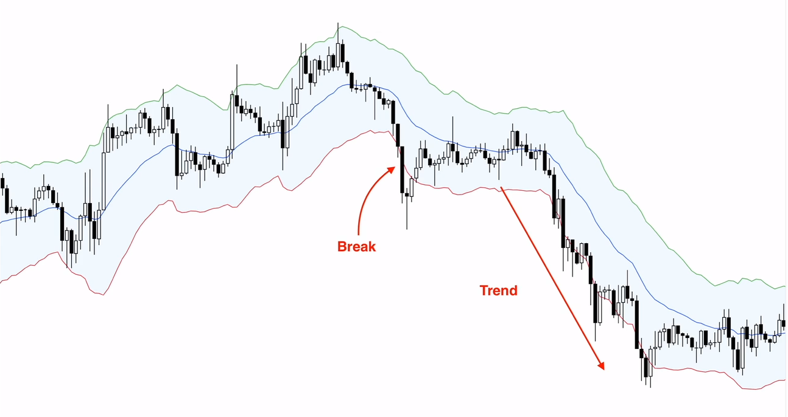
- We want the channel to be respected for a extended period and only then in case of a breakout we should follow a trend
- In this case the stop would be the upper line
- We can do this for a short or for a long case the case is the opposite
- When the price is respecting the channel again you should exit
# Volume Analysis (Volume profile / Market Profile)
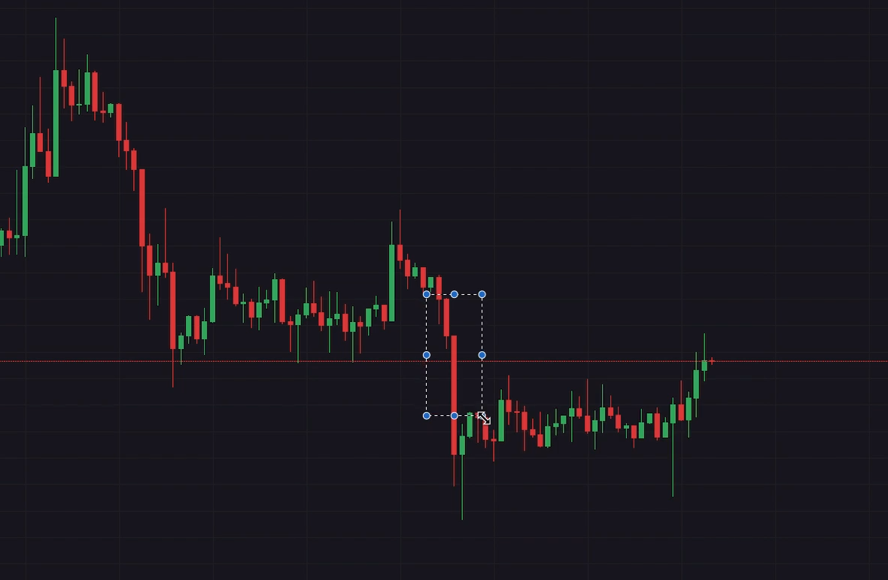
- In this scenario we see a gap when there are multiple candles of the same type (negative for example)
- We should assume that price wants to fill those gaps
  - Price wants to be normally distributed usually
    - The reason? We dont know why
      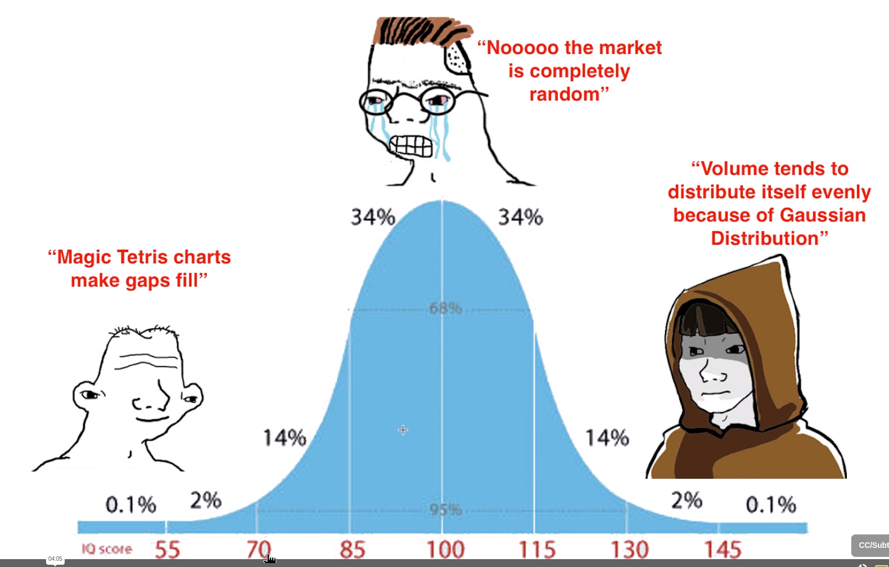
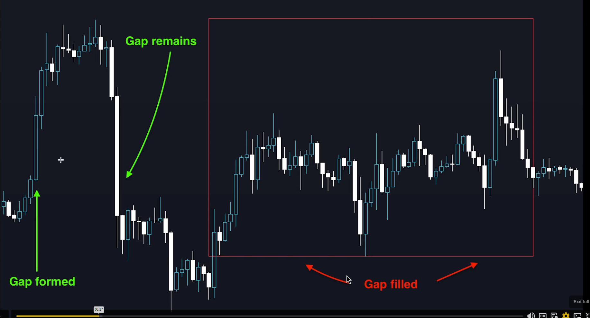
- It happens in all timeframes
- When it starts to fill then the higher chances it will actually fill
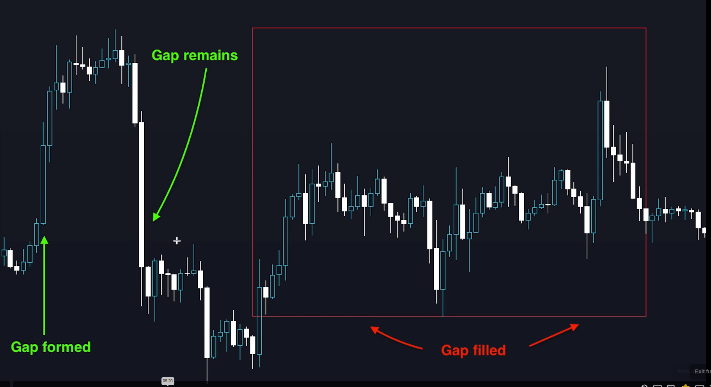
- Professor uses `SVP` (Session volume profile)
  - In defs we can activate POC which is a way to see the higher price point in terms of volume
    - This is good to see the points where there is more interest to enter and exit a given trade
    - We can understand that the more we go far from that point the more people get squeezed and also where we can expect a support or resistance
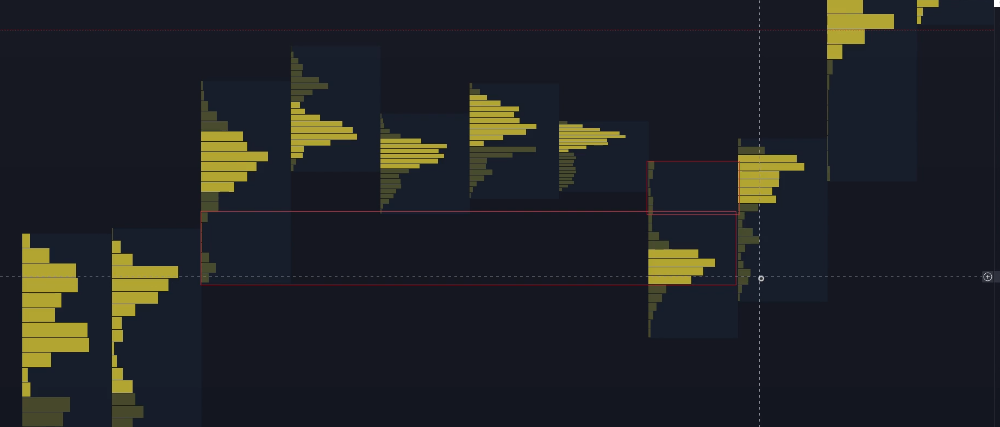
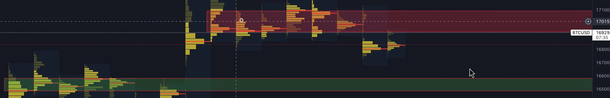
- When we have a lot of volume and there is still a failure to go in that direction, that means there were a lot of people that got recked
- In the resistance when it failed to go higher there was higher prob that we were about to go down
- Wait for gaps and expect to fill them, it is not complicated
  - In the support/resistance areas if it fails to surpass or to maintain we go into the direction of failure
- We can also draw gaps with vprp
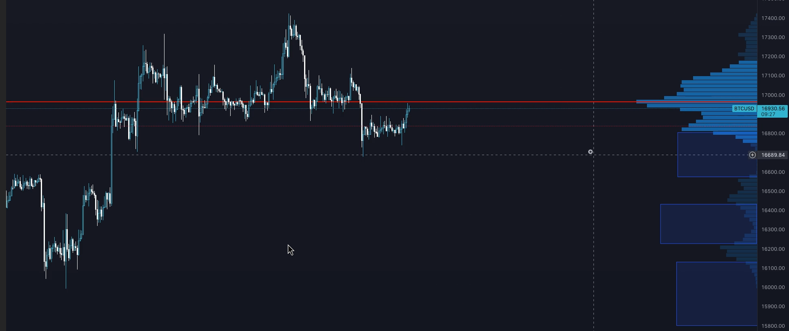
# RSI
- Measures the strength relatively
- More important in higher time frames
- Levels to watch out are 70 and 30
- RSI is based on the candle body, ignore the wicks
- The author starts by analyzing the weekly and then daily
- Divergencies are not frequent
- We can still use the rsi for lower time frames but its less relevant (if in 4h we have reasons to go short we should go short even if in  minute we have reasons to go long)
- Higher time frames > Lower ones
## Divergencies

- This happens when the price is increasing but the RSI is decreasing and thats a bearish signal
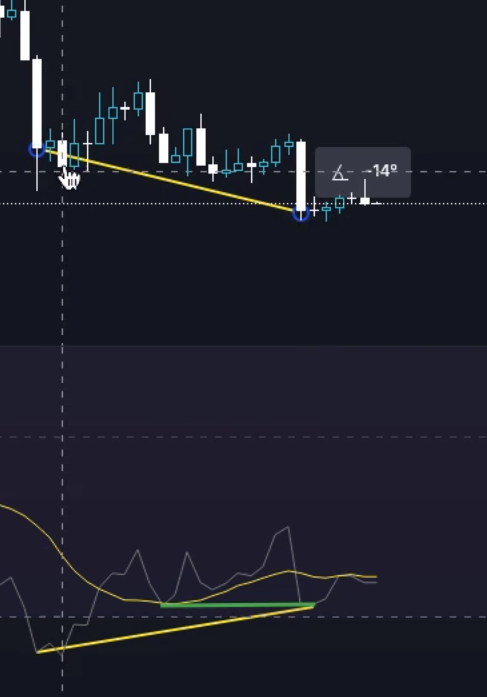
- On the opposite idea we have a bullish rsi when the price is decreasing and the rsi is increasing
## Strategies
- Catching this divergences
- Doing this to btc and then catch the move effect of btc in the alt coins
- You can also catch the 30 level and go long until it reaches 70
- We have a RSI with average movement called RSI Div-KT
  - Good to see because it is more active
- We must be carefull because after hitting firstly the 70 its probable that the price keeps rising causing a divergencie
- The best trades are when we spot divergencie in weekly or daily and then in the 4h try to enter the extreme points and go in the opposite direction
- When a BS or MBS occurs we should check if there is divergence between rsi and the price and only go short/long when it goes to 30 or 70 (or closer)
# MACD (Moving Average Convergence Divergence)
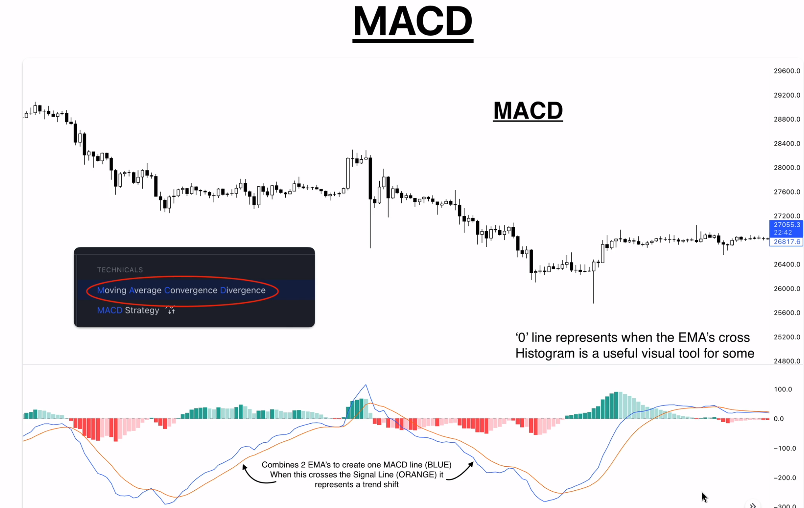
- Created to make it easier to understand
- Meant to trend following
# Momentum
- Used to measure speed and strength of price movements
- Nice to check possible trend reversals
- Should be used along with trend indicators
- Bellow zero is bearish
- Above zero is bullish
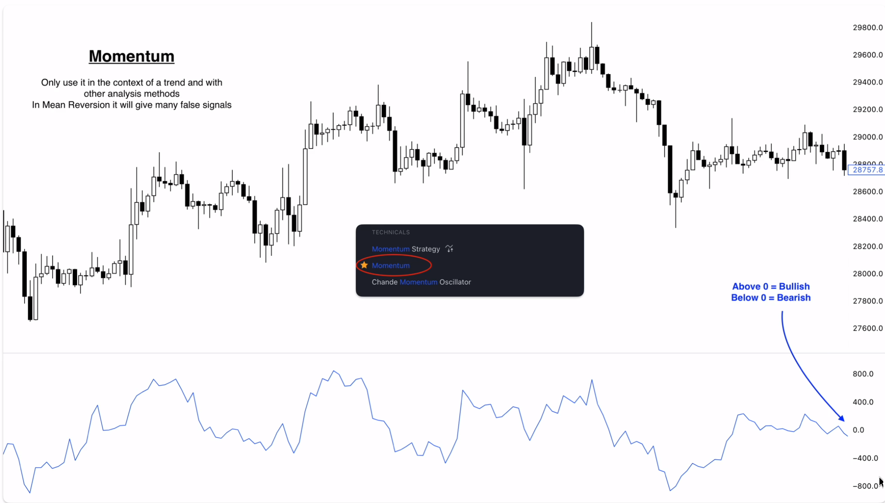
- We should look for places where it is close to zero
- Should be used in confluence with other indicators
- Good with KC and bollinger bands