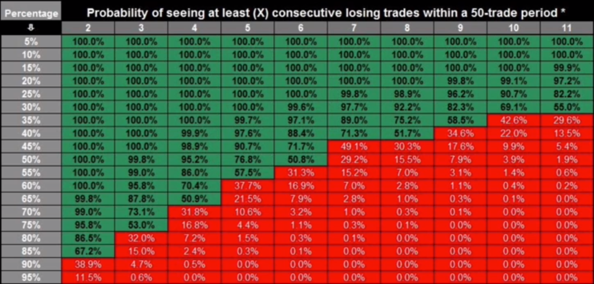
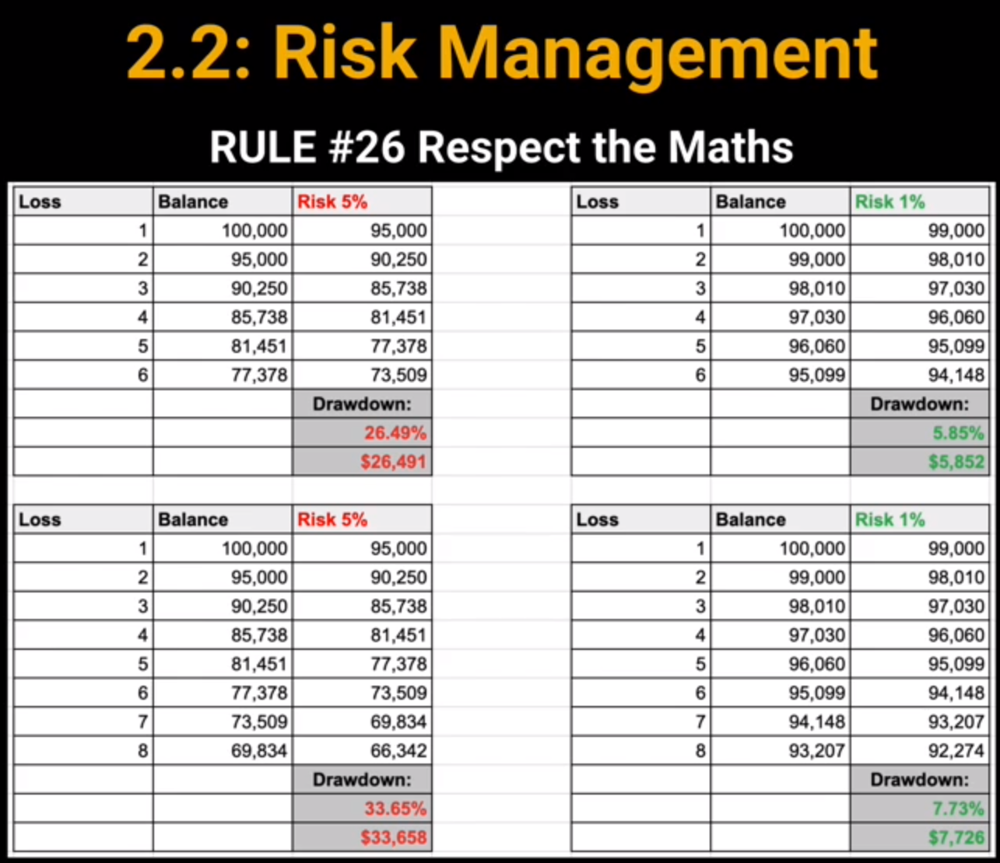
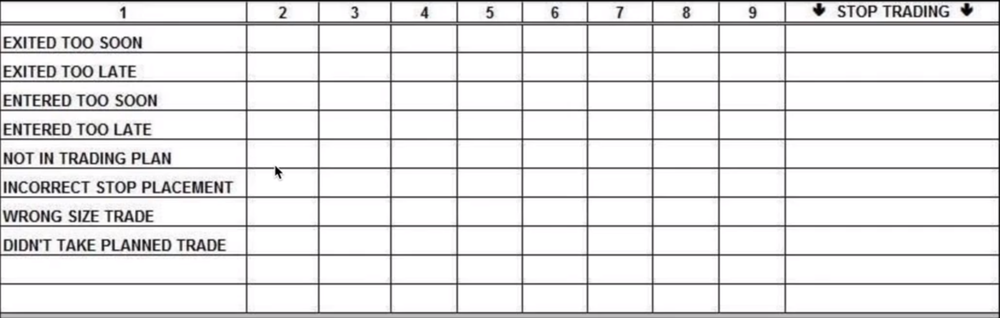
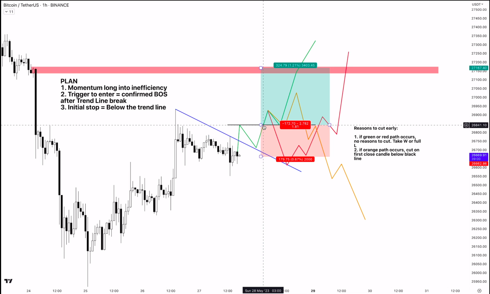
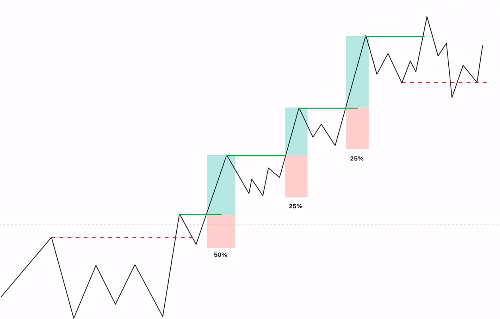

# Overview
- Knowing ourselfes
- Betting ourselfes is the enough to beat the market by controlling our emotions
- Success comes from:
  - Your habits
  - Understanding Probabilities
- High win rate is garbadge, profit its the only thing that matters
# 2 Principles of Psychology
- `Why traders loose`
  - Poor emotional control
  - Greed/Fear
  - Impatience
  - Ego
## Principles
- `Principle 1`
  - Each trade is a new event
  - The previous trade should not influence the next trade
  - You should apply always the same rules of the system despite failing too many times
- `Principle 2`
  - Consistent trading is a habit
  - Understanding my own system and following the rules
  - Getting a system and test it for 30 trades with a concret and precise plan
  - Use the actual exchange
## How to lose fomo forever
- Fear of missing out
- Ignorance is what causes this decisions
- `How to avoid fomo`
  - Educate yourself
  - Create a Plan
  - Practise Patience
  - Limit Exposure to Social Media or News
  - Practise Mindfulness or Meditation
  - Consult financial advices
  - Develop Healthy Coping Mechanisms
  - Practise Gratitude
  - Diversify your interests and investments
  - Acceptance and elf-compassion
  - Stay Active and maintain physical health
  - Cultivate offline relationships
  - Avoid impulse Buying/Investing
  - Establish a Budget and Stick to It
  - Seek Professional Help
  - Set Specific and Realistic Goals
  - Focus on Long-term Goals
  - Prioritise Personal Well-being Over Materialistic Pursuits
  - Emphasise Quality over quantity in experiences
  - Regular digital detox
  - `Complete the challenge`
    - 30 perfect trades
    - Follow exact rules
    - Risk max 1$ per trade
    - Journal every trade (entry,exit,etc...)
    - If we break the rules we should start again
    - Have rules and stick with them
    - Pumps dont matter, dumps dont matter, only systems matter
## How to kill revenge trading forever
- There is a bascketball study where there were 3 groups of players
  - 1 group trained ball throws
  - 2 group visualized the throw
  - 3 group did nothing
- 1 group improved 24%
- 2 group improved 23%
- 3 group did not improve
- `What is revenge trading?`
  - When a trader attemps to get back at the market after a loss by making more trades
  - Often this trades have higher risk so they can recover losses quickly
- `Causes`
  - Ego
- `How to avoid it?`
  - Have trading plan
  - Set Stop Losses
  - Understand Risk Management
  - Manage your emotions
  - Take Breaks
  - Use Trading journal
  - Set Realistic Expectations
## Become a Perfect Loser
- Theres nothing wrong with losses if we follow our system
- Be confortavel with loosing
- Challenge
  - Record the screen when we are doing trades to get a looser
  - After having 1 loose, then we should stop
  - Write in a paper what are we feeling by loosing the trade
  - Critical analyze our trade
# Make it impossible to get liquidated
## Tips
- Trade a system with no discretion
- Keep MAX 20% of your portfolio on a CEX
# Risk Management
- How much should i risk
  - Nothing until we complete the challenge of the 30 trades
- `Rules after doing the challenge/proving consistency`
  - Scalper
    - Daily loss limit
  - Day trader
    - Daily loss limit
  - Swing trader
    - 1-5% per trade
  - Position trader
    - 1-10% per trade
  - The daily loss limit is for stopping for a whole day
    - Typically less than 2% of portfolio in a single day
    - We cannot risk 2% per trade intraday
- The portfolio should be something that dont make you starve
## Facts
- The average winner should be smaller than you think
- The win rate can be 32% and we can still make money
- Your win rate can be 50% (or even less)
- Losses are essential
- Manage the risk or the market will do it for you
- Think about where you are wrong first
- The risk is always first
- The worst time statistically to win back your losses is right after the loss
- We never fully master our emotions,stay vigilant
- If you have massive winners, you are risking too much
# Risk Management deep dive
- Risk reward not reward risk
- R => Risk => How much in $ or % terms that you risk per trade
- Example
  - Entry 40k
  - Stop loss 39k
  - Profit target 42k
  - Risk Reward = 2R(1:2)
## What risk management really is
- Understanding max drawdown prob
- Using hard stop every time
- Having a soft stop (early invalidation)
- using a trade planner
  - This is exacly to know which trades not to take
  - We can see which conditions do make us winning trades (if i have better high win rate in certain conditions or not)
## What risk management is not
- Simply having a stop loss
- Risking 1-5% of your balance per trade
- Cutting trades early because you 'feel' its going against you
  - If there are signs for that then its ok, otherwise no
- Moving your stop up to Breakeven
  - Makes sense in higher frames
  - In a scalp is garbadge
  - The market usually moves 4% intraday precisely to hunt those stops losses
## Importance of probabilities
- We should try to check the probabilities involved in our trades 

- Checking at which hours we have more win rate, checking which pattern has more win rate,etc...
## Respect maths

- Historie moral: risk 1%
## Prevent you from fucking you
- Dont change position size
- Dont let streaks affect the plan
- Dont trade when you have a lot of streaks.. the probs are against you

- The professor has this parameters for scalping when by making the same mistake x times makes him not trading more on that day
- We can use this also for swing in multiple days and make yourself stop from trading 1/2 days and reflect about it
  - Reflect your attitude
  - Reflect the system
  - Etc..
# Trade Management
- Proper Planning
  - Multiple paths
  - Clearly written plan
  - 99% of trade sucess is planning
  - start with the stop
- Execution
  - More executions = more trades = more risk
  - If plan is correct, executions should be minimal
- `When winning`
  - Do fucking nothing
  - Never revise target for full trade
  - Partial Profits
- `When Losing`
  - Stick to your stop
  - Dont Average Down
  - Losers are necessary
- `Tips`
  - Try not to adjust your stops and take profits until you understand full your strategy (after experiencing it with a vast number of trades)
  - It always goes to a given plan
  
  - As we can see here we have multiple prob scenarios that we can expect from this trade
  - We plan the trade and if it goes wrong we usually take the loss just because its hard to predict the next scenario
  - As you can see we should cut early in orange because it did a confirmation and it failed
  - The professor says that we should maximize our profits
    - Also, partial profits can be a good strategy if we see it getting to a firdst target price
    - Partial profits is a bit messy because you are taking out possible future profits
    - Ex: in that example the author said we could take 75% profit in the red zone and then taking the profit upwards
    - Professor says usually its better to take 100% of profits in those points because its less complicated
    - In case we want to still pursue partial profits we should go like 75%/80% otherwise we are leaving to much profit in the table
    - Get over the feeling of losing
    - Trust your stops
    - Do not add more position when you are losing
    - Looses are necessary
## Pyramiding (compounding)
- Only works when there is a trend
- steps
  - Enter your core position (30-50%)
  - Set your TP and SL
  - Wait for the price to reach your profit target
  - Instead of TP you add to your position
  - Adjust your stop loss
  - Repeat steps 3 to 5 if the price continues to trend
  - Have a strict exit strategy
   
  - You enter in bullish BO but you exit in MBO bearish
  - Its a good strategy because the worst scenario after the first confirmation is getting a stop into the profit
  - Also in case we reach one of the legs with a lose we may have other legs profits
  - Supposing in the first leg things go right we set a stop in the MBO and we exit in profit
  - Exit when the trends is likely reversing
  - Put stops in not obvios levels
  - Getting hunted is just normal
# The law of Large Numbers
- DOnt try to win big
- Whin small and do compounding
- Dont be greedy and impatient
- Year 1 we should survive
- Year 2 we will grow 
- We should start with 1$ or so just to make the trades cheap since we will most likely loose at the beginning
# Win rate
- Win rate = (winning trades/total trades)*100
- Win rate is a destruction indicator for a novice trader
- Profitable traders have <50% win rates and still be profitable because of the risk ratio
# Risk Reward
- How much we profit from a given risk that we set (risking 1 units to win 1)
- Great mental model for life
- Its better to think in risk ration than dolars
- Risk 100$ for 300$ means a 3R/A
# Expected Value
- Helps to understand which trades we should take or not
- With time we will have the prob of winning a given trade
- EV = RISK,REWARD AND PROBABILITY
- EV=P(W)xReward-P(L)xRisk
- Ex: (60% heads,40% tails)
  ```
  EV=(0.6*1)-(0.4*1)=0.2
  the 1 means the number of trades
  AKA Positive Expectancy
  ```
  ```
  EV=(0.4*1)-(0.6*1)=0.2
  AKA Negative Expectancy
  ```
- Basicly despite having this probs there was still people beting in the 40% because of streaks
- Take 100 trades and then think in size
# Negative expected value (example)
- CPI pump
  - pump that got originated by news
  - Techninal indicators dont work in these days
- When there is a CPI the technical traders dont trade because technical indicators fail in those times
- If you think in making your stop more wider  then you are admiting that your settup will not work and with that beeing said you would wait for the price to fall to that point instead
# Position Sizing
- If we are newbies we should do the few dolares trades first
- `Fixed Position Size`
  - It simplifies decision making but ignores varying levels of risk across trades
- `Percentage Risk Model (Recommended)`
  - Risking 2% of account balance on each trade
  - The best one where we risk for example 2% and we try a risk reward bigger than 2
# Conditional Probability
- Likelihood of something hapenning because something happened before
- We already had lessons about conditional probability 
- But we should use it with other data
# The secret to achieve any goal
- We need to understand that it takes time
- Macropatience.. doing everything in our reach to accomplish those plans
- Act with micro speed but macro patience
- Working hard every day but that goes into a weekly goal that then goes to month goal that goes to a year goal
- We should focus in cash flow firstly and then when we are more consistent we can use it in trading
- Working more or working smarter
- Cut cheap dopamine
  - social media,alcohol,smoking,excess caffeine,etc..
- Beeing acountable to others (using your ego un a healthy way)
  - Saying that we will crush a goal and make it happen
- We should do goals per day,week and month