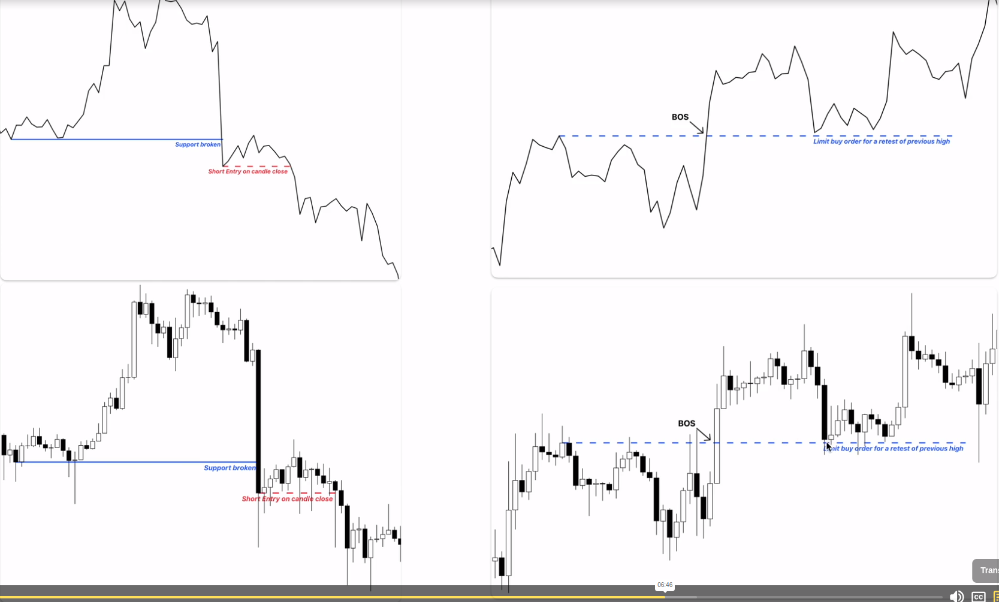
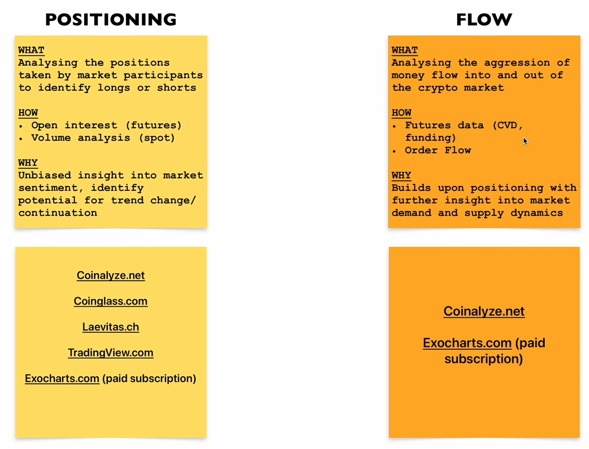
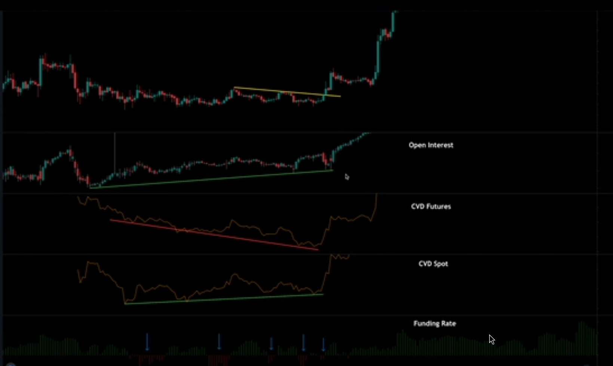

# Finding Active Coins
- You are only as good as the coins you trade
- We require volatility to make money
- A coin/token that you can trade calls itself active coin
- There are coins that only are volatile when they are hyped
  - This can be hype in a concrete token
  - Can be hype on a new narrative (ex: native)
  - They are subjective
  - To go against this subjective we use tools
- In tradiew view we can see `crypto pairs` which helps us out on that
- We should look the volatibility
  - Dont look to the ones with the most volatibility
  - We should look for the ones that have volatibility and measurable movements
- We should filter the garbadge by filter by CEX (binance,ByBit and COINBASE)
- We still need to make sure that there is volume because by having only volatibility it may mean that the ative itself is easy to move the price because there are no people trading it
- After filtering the screen weill become much better (if you know some of those coins that also something good to observe)
- We should then check out the volume
  - We should have a standard for minimum volume
  - Higher volume means higher participation and more opportunities to trade
- Filter to atleast 1M of Volume (in the 24h in USD)
  - You still need to look at relative vol
    - Put the relative volume 2.19 (would be the best), because if lets say in a normal day we traded 20M, then relative volume will be such that in the current day we will have 20M*2.19 = 40M
# Trading view crypto pair screener
- We did as we previously saw
  - We removed almost all the headers leaving only the VOLUME,RELATIVE VOL,VOLATIBILITY and EXCHANGE
  - We putted a minimum of 1M in volume
  - We putted RELATIVE VOL upper than 1 atleast
  - We selected only three exchanges: Binance,ByBit and Coinbase
- We should also check the project
- Check funding data
- Check community
- Check release of tokens
# Backtesting
- Using historical data to see how well a strategy works
- Markets are ever changing, so we should always adapt the system and avoid bias
- We can do manual and automate backstage
- Only backtest timeframes and times that you will be watching the market
  - Trying to make the system in the hours we can actually check the market otherwise it will be irrealist (ex: checking out every 8pm hour candles or simply selecting timeframes where we can check the market)
- Market bar replay is payed
  - We have 30 days free
- We should aim for 100 tests
## Manual Backtesting
- It should always start with a question
  - `Is VWAP or 12/21 EMA cross a better confluence tool for trend shift on the BTC intraday timeframe?`
- After answering to that questions simply define more terms
- We must set execution rules for this backtesting
- Learn how to backtest simply, you dont need to grab a winner right ahead
- We should only put the rules within that internal
  - Theres a case in the video where if we continued in the trend the profits would be better but if we cant be seeing it it is hard to backtesting it because we are out of the computer
- Run the tests, compare and add or remove variables
- Dont be lazy
- [Add this script to select the timeframes](https://www.tradingview.com/script/rhdChhth-Prof-Michael-G-Backtesting-Time-Periods/)
- [Sheet for the backtest](https://docs.google.com/spreadsheets/d/1ieSMq46Hx8gkp6SURtdJ5x91BppMP4oE7zkEwiMZTUs/edit?usp=sharing)
# Not all trades are equal
- Systems do not perform the same in different assets, environments and states
- Every trader has its own style 
- Some patterns deserve more risk to be taken and others less, this is related to the trade size that we already spoke about
# Entry techniques
- We must have a clearly defined condition
  - Must be objective/systematic
- Best confirmation is candle closes (breaking MSB or BS)
- We can also buy when there is a retest

- You can enter 50% on candle close after MSB and another 50% on the retest
# Exit techniques
- Reasons to entry are the same as the exit when we see a bearish MSB for example
- We can also do the same as the 50% rule in the entry
- Dont forget to have a stop loss
# Daily Trading Routine
- Routine example
  - 1. Read news
      - Coindesk/Blockworks (Crypto)
      - Bloomberg/WSJ (Macro)
      - Trends and macro news are important
  - 2. Scan for active coins
      - Scan for active coins
      - If it is on the news and also in the scanner => 2 indicators of movement
  - 3. Chart Analysis
      - Checking out the coins that we founded in step 1&2
      - Chart from High time frames to Low time frames 
        - Checking weekly trends/supports/etc..
      - Check if the charts justify more research
  - 4. Find your focus coins
      - put alarms in sensitive zones in case they exist (ex: Price moving to a sensitive area)
      - Check their twitter
      - Check the telegram
  - 5. Enter trades
    - Check Risk/Radio and enter a trade
    - Take a screenshot of the trade on trading view and you can paste the link of the trade in the spreadsheet
  - 6. Live trading
    - Manage open trades
    - Exit trades
  - 7. Log the trades
    - Get all the information, including comments for that trade,risk,score for the risk done,execution,profit or loss,etc..
  - 8. Post trade review
    - Review your own trade
    - Check what got wrong
# Winners workflow #1 - Daily Journal
- How to set yourself up like a pro
- By writing in the journal we can understand in which situations i should not trade
  - By example the teacher reached the conclusion that it is not good to trade for him at weekends
## Part 1: Daily Journal
- We must feel the pain of the loss
- Record all experiencest
1. Morning thoughts
- Important to have toughts as long as you wake up
- 2 parts:
  - Opinion
    - Training intuition & general market knowledge
    - x will happen because of y
    - subjective
  - Facts  
    - Things that happened over night
    - Events that are relevant for today
2. Daily programming
- Repetition develops skill
- Focus on RISK and GOALS
- RISK
  - Put a maximum amount that we can loose for a day, in case we loose those we should stop trading
- GOALS
  - Prayer
    - Pray to god for good choices
  - Affirmations
    - Affirm that you will do compound options
3. Morning market analysis
- Make chart analysis for the daily
- Do it using our system that should evolve over time
- Just start
- 15 minutes max usually
4. Trades
- Update the positions in the journal
  - For open positions explain why is still valid
  - Explain why we closed a position
  - Track any new trades
  - Fill the sheet
5. Narrative
- Overall primary narrative
- Changes from yesterday
- What is new today
- Themes to research
- check which narrative will influence your systems
6. End of day review
- Trade recap
- Emotional score
- Mistakes 
- Wins & learns
7. POWER update
- If we feel powerful or not
- Check the pattern for the day (why are we feeling powerful or not)  
- Hack your brain using those patterns
# Position and flow
- Position and flow (Best confluence system for any strategie)
- In markets, logic is retarded
- Market does not care about the opinion of influencial people
- Price is what matters the most
- Its hard beeing a contrarian trader (going against what people is doing)
- Its easier to go with the trend, entering when everyone is entering in that same direction
## What is Position & Flow
- Complementary factors of each other
- `Positioning`
  - How many traders are getting long & short
  - Where are they entering & exiting
- `Flow`
  - Who is being more aggressive? Buyers or Sellers
## How to measure

- Open interest is to check how many contracts are opened and in which direction
- We should check this to get unbiased opinions
- This indicators are best for Low time vision
- This is important for swing and day traders
- Our job is to time the reversal
## What to look
- When open interest rises it means new traders are entering
- CVD futures
  - Seeing to each side it is getting aggressive
- CVD Spot
  - Seeing to each side it is getting aggressive but for spot
- Funding rate
  - It needs context with a whole analysis

- In this case the context is that price is rising,open interest is rising so there are new traders entering, cvd is aggressive for short which means they will get squeezed and make price go up,CVD Spot is rising and funding rate is increasing so prices will increase
- Basicly we use this to go into the path with least resistance 