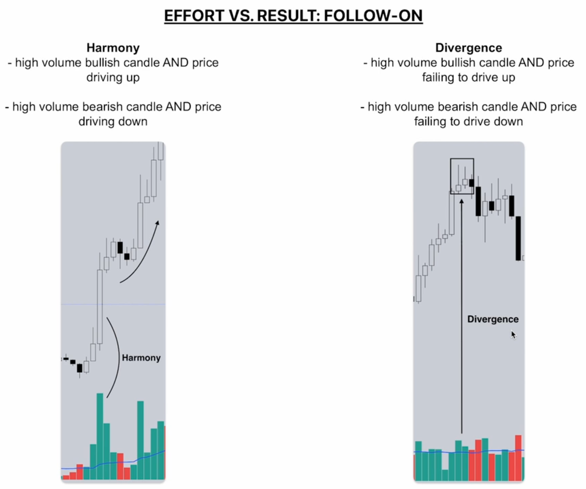
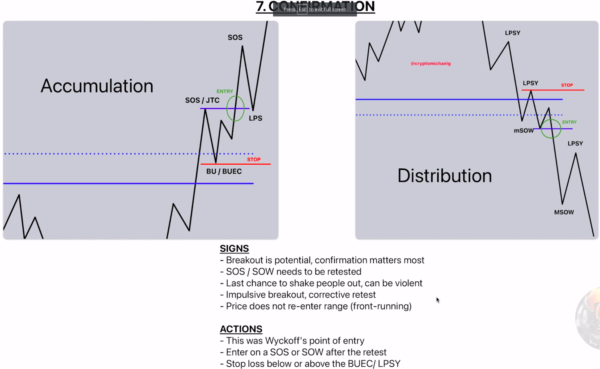

# Price Action
- Price is a fact, everything is opinion/speculation
- You dont buy on chain activity,hash rate,oversold or a indicator
- Indicators are guesses of what might happen
- An RSI overbought means nothing without a change of price action
# Direction VS Path
- Direction is saying that we will reach a certain price
- Path is how we reach the price we said we would accomplish
- We should focus on PATH 
# Market Phases

- Either goes up,down or sideways

- Green is accumulation, blue is mark up, red is disttribution and the orange is mark down
- We can have multiple accumulation until distribution and the same goes in the other way around
- We cant trade like trends are always in reversal.. We have bullish,bearish and neutral trends
- To come from a bullish to bearish and vice-versa we normal go throught a neutral trend which is a side-ways representation
- Also, having a neutral does not mean we will have a trend reversal.. we can go from bearish to bearish and so on.. price action dictates it
# Trend Following

- We want to follow the trend and not suppose that something is going to happen
- In the red we have a range or accumulation that after getting breaked you see that we got a Mark up which is a trend 
- Not that when the price does retraction, goes up and then gets a lower low or when we break up a range we have a trend change or a price trend that follows that direction
# Mean Reversion

- Taking advantage from the accumulation or distribution area to get some profits (the legs inside of the range)
- This trading style is usually more profitable
- Market passes more time in ranges than in trends
- Real traders make good money in ranges
## Summary
- Trend following 
  - we buy dips and sell bounces
  - Shallow Pullbacks in a breakout/up trend is a buy opportunity and shallow pullbacks in breakout/down trend is a sell opportunity
  - Exit on Mean Reversion
- Mean Reversion
  - Buy Range low, sell range highs
  - We shouldnt buy dips/sell bounces
  - We should repeat until failure, we will eventually get it right
# Waves
- wave is the path until reaching one place to another in terms of price (a trend with multiple breaks until reaching a given point)
- Price moves in waves
- The timeframe will change the way we see the graph altought it is the same chart

- Waves differ from timeframe to timeframe
# Nature of Trends
- Impulses & Corrections
- Impulse is how the price is moving
- Correction can be a pullback or a bounce
- Path follows the least Resistance

- We have uptrend,downward and range
# Nature of Ranges
- Represents 70-80% of price ranges
- There are a lot of fake outs
- Flat channel 
- There needs to be a Reason for Price to move to a new level
# Market Structure
- Most important concept
- Where trend ends
- Where new trends begin
- How to identify the best entry & Exit
- We need to understand market at all levels
- Wyckoff Theory & Dow Theory
- Wyckoff
    - Wyckoff theory for higher timer frame
    - Supply & Demand cause and effect
- Dow Theory
  - Higher high & Higher lows uptrend
  - Lower lows & lower highs downtrend
- Sometimes the market moves randomly, but usually it moves with intencion
# BOS (Break of structure) & MSB (Market structure break)

- Bos is when we break the trend highest point (either upward or downward)
- Msb is when we break the wave (the support zone/correction) that resulted in the last Bos
- We shall wait for candle to close out for confirmation
# Trend reversal

- Trend shift happens always when exists a MSB
- Always wait for candle closing (in order to have a confirmation we must have a candle with body breaking the MSB.. a thin body doesnt mean it closed on that price range, it only means it was there once)
- BOS and MSB's are marked in the body

- As you can see the BOS and MSB are marked in the closing of the candle and not on the thin body
- We shall use line and bar charting

- A swing is the area within a BOS
  - Swing low is the most lower point in the swing
  - Swing high is the most higher point in the swing
  - The MSB (Market structure break) is the swing low
  - Interim Low is a low that isnt the lowest point
  - MSB does not mean a trend shift every time so we need to be carefull (fake breaks/stop hunters)
# Best reversal pattern

- As you can see the level is drawned with the thin body because that level is meanted for the stop losses. Msb's or BOS are drawn with the body

# Trend lines
- Good for confluence with other indicators
- The best trendlines are the ones that everyone sees
## Rules
1. If a trendline respects price action, look for entries in the same timeframe or lower
  - If the trendline is in the direction you expect to hold for continuation then we should search entries on that direction

    - There is a impulse move up and then it enters a trend line
    - High probability of moving upward because the trend is upward and the trendline is upward
    - We should remove short positions in this scenario
    - Remain long in case nothing changes
    - Trying to enter in the probable breakout

    
    - There is a impulse move down and then it enters a trend line
    - The rest of the rules are the opposite of the last pattern

    
    - Theres a move up
    - Theres a big correction in the horizontal
    - Try to buy in the breakout

    
    - There is a move down that after grabs a trend upward
    - We should notice that we shouldnt trade a tradeline before it has a impulse
    - We should use this patterns in lower time frames or the same time frame

2. If a trendline breaks, take not and become defensive 

    - When the trend breaks, we trade it defensively
    - Theres a possibility of take profits if we stick to a short after trend breaking
    - Case short you should partially take profits in the neutral zone and take the full profit case it bounces to the last chance

    
    - The same goes in this case, case the trend breaks we trade it defensively
    - POssibility of take profits if we stick long after trend breaking
    - Case in long we can take some of the profits in the neutral area and take the rest in the final chance part
    - We can change our position to short when we enter trend reversal 
  
  3. If a steep (ingreme) trend breaks, trade it back to the shallower trend  
  
      - Sharper angle
      - We shall enter for the next trend to use it to get the impulse
  
      
      - Sharper angle
      - Use it to drive to the less sharper angle
      - In this case we could have go long in the breakout
# Supply and demand
- Demand > Supply = Price up
- Supply > Demand = Price down
- Supply and demand is the intent, its passive
- Sellers & Buyers are active, its agressive
- This is the rule number one
## Supply & Demand VS Sellers & Buyers
- Supply & Demand = Passive (Limit Order)
- Sellers & Buyers = Active (Market Order)
- Supply & Demand can only stop price
- Only sellers & buyers can move the price

## How to measure supply & demand
- Low Timeframe (minutes) = Order Flow & Harmonic Divergence Matrix
- Mid Timeframe (hours/days) = Harmonic Divergence Matrix
- High Timeframe (weeks/months) = Price Action Structures
## Example of what can happen in a market
- Lets suppose we have the following:
  - 1000$ market cap
  - 1000 tokens
  - There is no burning or minting mechanisms
  - This way the market price is 1$
- Ok, now supposing we are about to make a market order to buy 1 token but the only price a seller sells you that token is 2$
- Since we made a market order we will buy the token for 2$
- Since we bought a token for 2$ and the last value of that token was 1$, the market cap will be incremented by (2$-1$)=1$
- This means the market cap now will be 1000$
- The price now of market at least will be 1,001$
# Cause and effect
- Accumulation/Distribution = Cause
- Uptrend/Downtrend = Effect
- Smart Money & Dumb Money
- Causes are constructed by Smart Money

- Longer accumulations/distributions trends have higher effects
- Smaller accumulations/distributions trends have smaller effects
- Smart money is a walle
- In the hoolidays (friday,saturday and sunday) the smart money does not play a role.. which means we have ranges instead of effects
# Effort vs Result
- Price action & Volume 
- Efort = Volume
- Result = Price
- Harmony or Divergence between both
- More volume, more bigger players
- Harmony strength in the trend
- Divergence weakness in the trend (reversal coming)
- Divergence is a trap
## Harmony
|Combinations of efforts|
|--|
|High volume + impulse|
|Low volume + correction|
|High volume + wide range|
|Low Volume + narrow range|
|High volume + level break & hold|
|Low volume + level fails to break|
|Rising wave in a impulse|
|Declining wave in a correction|
## Divergence
|Combination of efforts|
|-|
|Low volume + impulse|
|High volume + correction|
|Low volume + wide range|
|High volume + narrow range|
|High volume + level fails to break|
|Low volume + breaks|
|Declining wave in a impulse|
|Rising wave in correction|
## Harmony VS Divergence

- As you can see when we get above average volume of buying it makes the prices go higher
- We got a divergence after the volume went bulish and also the price action and then we having a sell volume above the average and a bearish candle, which resulted in a trend shift
- Harmony Vs DIvergence, identifying them is very important
# Effort VS Result
- We must see if what is happening is in harmony

- Harmony means that we are in the right direction
- In case we have high volume and narrow candles, that means we are not in the right trend
- Divergence may tell us that the trend is about to change
- High volume, narrow candles, means that the price is starving to go into the desired direction which means that a trend change is about to happen

- Volume increasing means harmony
- Volume decreasing means divergence

- Even with price action and with harmony in the short frame, if we have divergence in terms of volume in the bigger picture, that means that we will have a trend change in the future

- When a level breaks, if the resistance gets respected despite low level, that means continuation of the trend
- Also, in a divergence if it breaks the support but it backs up again to the trend line that also means a continuation of the trend because that means that the high volume in the opposite direction was not enought to drive the price lower
- Patterns are not just price action.. we need to look to the volume as well and the candles

- This is how we enable volume average
- We should also put the MA to 20
# Trend Climax & Exhaustion
## Trend climax

- Divergence normally means trend change
## Trend Exhaustion

- Lack of interest leads to trend change
- Lack of interest to sell leads to rising of the prices
- Lack of interest in buying leads to decreasing of the prices
# Wyckoff Events Overview
- There are 7 events in wyckoff theories:
## 1. Preliminary Stop /Preliminary Support (in accumulation)/Preliminary SUpply (in distribution) (PS)
- First sign the buyers are steping in
- Looks like a bottom or a top
- Meant to trap early longs or shorts
## 2. Climax (SC)
- Happens after the Preliminary stop
- Normally eats the stops
- Normally violent but not always
- Goes Bellow or Upwards the PS
- Its the bottom but people does not feel it like a bottom
- There is a fear
## 3. Reaction (AR)
- This where we have a reaction from the bottom
- Price goes almost to the same high as the last high with the PS
## 4. Test (end of Phase A) (ST)
- Poins where bears are loosing control
- End of PHASE A
- We can have multiple tests
## 5. False Breakout (UA,ST as SOW,SPRING and test)
- Traps forged by smart money
## 6. Breakout (LPS,SOS/GTC and BU/BUEC)
- Where price breakouts
- Takes a lot of effort by buyers
- Sellers must give up
## 7. Confirmation (BU/BUEC)
- Comes from a retest
- Volume on breakout should be higher
- Retest should be low volume

# How to trade wycoff events

- Theres high provability of climax because the pull back was more than 75% of previous trend leg
  

# Wycoff Terminology

# Wyckoff Phases
- `Phase A`
  - End of the previous trend
- `Phase B`
  - Construction of the "Cause"
- `Phase C`
  - Test
- `Phase D`
  - Trend within the Range
- `Phase E`
  - Trend outside the Range
# Horizontal Structures
- Searching for SOC, shift of control

# Sloping Structures

# Charting Support & Resistance
- Subjective
- Choose obvious levels
- We should hope that others see the same that we are seeing
  - Best patterns are the patterns that everyone can see
- High time frames closes are the best Support/Resistance
  - Monthly,weekly and daily
- We should search for support and resistance in higher time frames and then we can name them by naming the horizontal lines that we intend to put
- We dont know if it is support or resistance until the price tests the line because it can break and use the line as support instead of resistance

- This is monthly SR
- The author starts by creating the mountly SR and then goes for weekly levels
- The author has a color tier (stronger,mid and weak)
- Test those levels, this is a bit bias
- Also we can use the monthly candle to check if we are in a bearish month or in a bullish month
  - Example:
    
    - As we can see here above the green line is bullish and down of it it becomes bearish
- The same logic happens when we speak about weekly trading or day trading
  - Example:
    
- 1st test = Best
- 2st test = Good
- 3st test = BREAK
- More tests more is likely to break
# Simple reversal patterns in price action

- Wycoff is good for smart projects like btc and eth
- This patterns are good for shit coins because there is no smart money involved
- We cant expect for the levels to be the same (the touches), this is not perfect but the format is alike (ex: a double top where the right side is slightly above)
- Its good to see which one appears the most in a given asset
# Liquidation
- Always an exact level (above or below wick)
- Its the stop losses and break out traders below or above a wick
- Wicks difer from exchange to exchange
- Look for sweeps (varreduras)
- Best liquidity levels for short term trading on the frist sweep:
  - Prev month H/L
  - Prev week H/L
  - Monday H/L
  - Current Week H/L

- The liquidation zones can and should be marked on the shadows
- Liquidation zones are very important because if the market grabs multiple zones of liquidation (multiple stops) then the market has more prob to have a agressive turn into the opposite direction
- Example:

- The professor says that the many liquidation places it takes the more you know it will go in the opposite direction because the stops got wrecked
- Liquidations are zones where we can get reversals